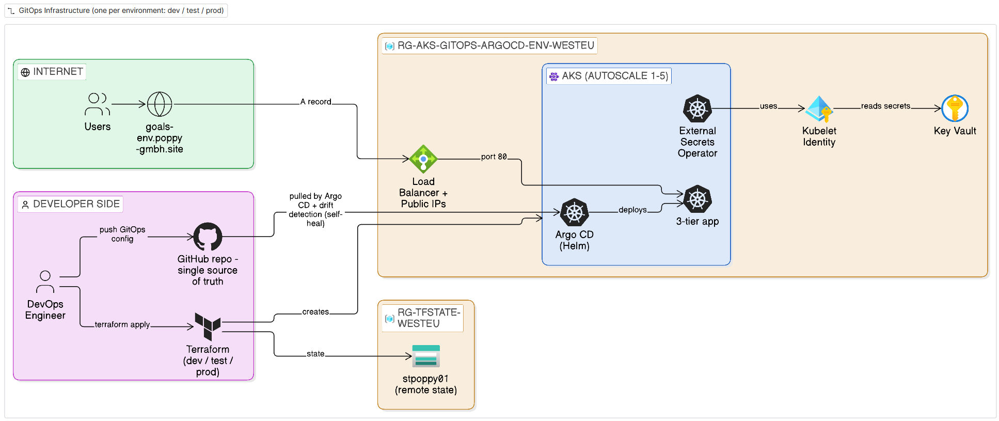
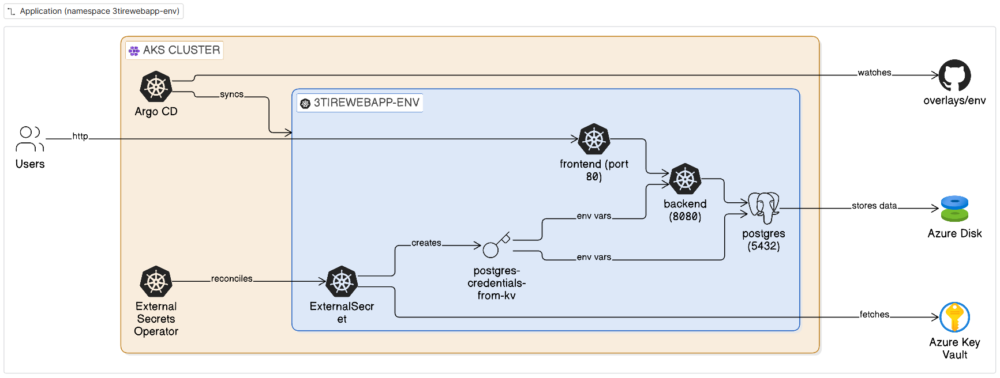

# Introduction

This project is an end-to-end deployment of a 3-tier web app on Azure Kubernetes Service (AKS). The infrastructure is built with Terraform, Argo CD is installed with Helm and deploys the app via GitOps, and the database secrets come from Azure Key Vault.

It's based on a project by [Piyush Sachdeva](https://github.com/piyushsachdeva), which I rebuilt as my own upgraded version.

## Features

- **Infrastructure:** Azure Kubernetes Service (AKS) with cluster autoscaling (1–5 nodes)
- **GitOps:** Argo CD (installed with Helm) for continuous deployment and self-healing
- **Secrets:** Azure Key Vault + External Secrets Operator, with an auto-generated password
- **Environments:** dev, test and prod with Kustomize overlays
- **State Management:** Terraform remote state in an Azure Storage Account
- **Access:** custom subdomain per environment
- **Networking:** Azure CNI with Azure network policies

## Architecture Diagram





## Challenges & How I Resolved Them

### 1. Upgrading the original code to azurerm v5 (Step 4.1)

The original code was written for azurerm **4.27**, but this project uses **v5**. Running `terraform validate` failed with:

```
Error: Insufficient node_provisioning_profile blocks
```

According to the [5.0 upgrade guide](https://registry.terraform.io/providers/hashicorp/azurerm/latest/docs/guides/5.0-upgrade-guide), two settings are now required. So the fix was adding them to `main.tf` ([Demo Step 4.1](Demo.md#41-maintf)):

```hcl
# AKS: "Manual" means the node pools are defined in the code, while "Auto" lets AKS pick VM sizes and create pools by itself.
node_provisioning_profile {
  mode = "Manual"
}

# Key Vault: It decides whether access to the Key Vault is controlled by access policies (false) or by Azure RBAC role assignments (true).
rbac_authorization_enabled = false
```

### 2. Helm and Kubernetes provider 3.x syntax changes (Step 4.2)

- The original code uses Helm provider **2.x** and Kubernetes provider **2.x**, but my project uses **3.x** for both. Running `terraform validate` showed errors:

  ```
  Error: Unsupported block type
  Blocks of type "set" are not expected here.
  ```

  In Helm provider 3.x, the separate `set { }` blocks must be written as one list. So the fix was changing them in `resource "helm_release" "argocd"` ([Demo Step 4.2](Demo.md#42-kubernetes-resourcestf)):

  ```hcl
  # Helm 2.x: one block per value
  set {
    name  = "server.service.type"
    value = "LoadBalancer"
  }

  # Helm 3.x: all values in one list
  set = [
    {
      name  = "server.service.type"
      value = "LoadBalancer"
    },
    ...
  ]
  ```

- Terraform also warned that `kubernetes_namespace` is deprecated in Kubernetes provider 3.x, so we need to rename it to `kubernetes_namespace_v1` in all three places where it's used.

### 3. Making the test and prod environments work (Step 2)

The original `test/` and `prod/` environments used the same manifests folder as dev, and that folder hardcodes the namespace `3tirewebapp-dev`. But the External Secrets script creates the database secret in `3tirewebapp-<environment>`. So in test and prod, the app would have been deployed into `3tirewebapp-dev` while its secret landed in `3tirewebapp-test` / `-prod`, and the backend and PostgreSQL couldn't find their credentials.

So the fix was splitting the manifests into a shared `base/` and one Kustomize overlay per environment, each with its own namespace, replicas and image tags, and pointing each environment's `app_repo_path` to its own overlay ([Demo Step 2](Demo.md#step-2-set-up-the-application-manifests-kustomize-base--overlays)).
